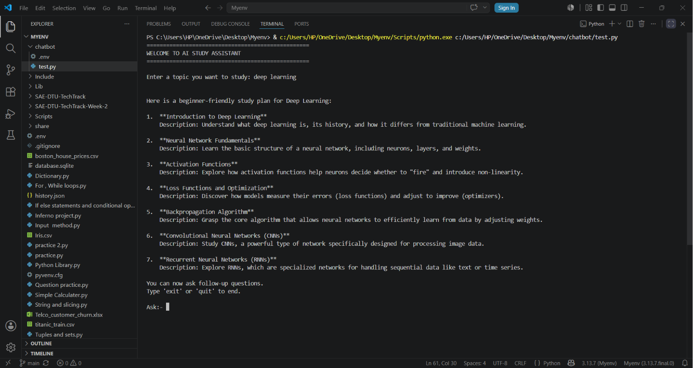

# SAE-DTU-TechTrack-Week-3
# AI Powered Study Assistant

## Project Overview

This project is a command-line AI Study Assistant built using the Gemini API. It generates structured study plans for any topic and allows users to ask follow-up questions in a conversational manner.

## Features

- Generate study plans
- Continuous chat loop
- Session memory
- Exit command
- Session summary

## Technologies Used

- Python
- Gemini API
- python-dotenv

## Prompt Engineering Writeup

### 1. Role Assignment

I assigned the role of an "Expert Academic Mentor and Study Planner" because it ensures the model behaves like an educational assistant and provides well-structured learning guidance.

### 2. Output Format

The system prompt enforces a numbered list format with short descriptions for each subtopic. This ensures consistency and readability across all study plans.

### 3. Removing the System Prompt

When the system prompt is removed, the responses become less structured and vary significantly in format. The model may generate longer and less focused answers, reducing consistency and usability.

## Setup Instructions

1. Clone the repository.
2. Create a `.env` file.
3. Add your Gemini API key.
4. Install dependencies.

```bash
pip install -r requirements.txt


